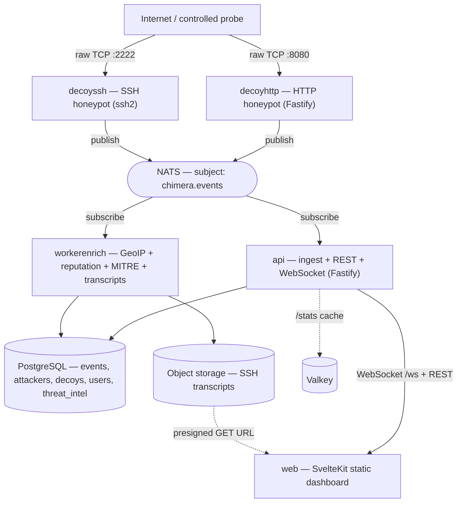
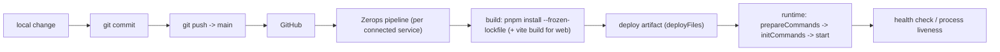

# CHIMERA — Deception Mesh

> **Turn every unauthorized touch into threat intelligence.** Chimera deploys realistic decoy services, captures every interaction as structured telemetry, enriches it with geolocation, IP reputation and MITRE ATT&CK context, and streams it live to an operator dashboard.

---

## Zerops Challenge 2026

Chimera was built for the **Zerops Challenge 2026** — a challenge to build and deploy a real, working product on [Zerops](https://zerops.io). Chimera leans into that: it is deliberately a **multi-service, event-driven system** (decoys, an event bus, a control plane, an enrichment worker, a live dashboard, and four managed backing services) so that the _deployment architecture itself_ is part of the story, not an afterthought.

## Project status

**Working prototype / hackathon MVP — deployed and running on Zerops.** The full capture → transport → enrich → store → visualize loop is implemented and live. It is a **single-tenant demo** with known boundaries (documented honestly in [§37 Current limitations](#37-current-limitations)). It is **not** production-hardened.

## Live demo

- **Dashboard:** https://web-2c44.prg1.zerops.app
- **API health:** https://api-2c44-3000.prg1.zerops.app/healthz

> This is a free-tier demo deployment; it may be paused or torn down after judging. Because the public decoys use **raw TCP** for real client-IP capture (see [§17](#17-http-decoy)), reproducible live signal is best shown via `pnpm demo:replay`, which replays **real captured** SSH sessions through the live pipeline.

## Repository

**https://github.com/rahilahmed-1945/chimera-deception-mesh**

## Screenshots / demo description

The dashboard has two pages:

- **Overview (`/`)** — a full-width dark **world map** (MapLibre) with attacker markers, a row of **KPI cards** (Events, Actors, Decoys), a live **threat-telemetry HUD** (Live Events, Events/Min, Active Sources), and a dense, newest-first **event feed**. Clicking any event opens a **case-file drawer** (source, location, reputation, MITRE chips, raw payload, and — for SSH — a replayable terminal transcript).
- **Intel (`/intel`)** — a three-pane investigation workbench: a search box + facet filters | results list | the same shared detail drawer.

---

## Table of contents

1. [What is Chimera?](#8-what-is-chimera)
2. [Why I built Chimera](#9-why-i-built-chimera)
3. [What makes Chimera different](#10-what-makes-chimera-different)
4. [Key capabilities](#11-key-capabilities)
5. [Architecture](#12-architecture)
6. [End-to-end event lifecycle](#13-end-to-end-event-lifecycle)
7. [Detailed service architecture](#14-detailed-service-architecture)
8. [Data model](#15-data-model)
9. [Event model](#16-event-model)
10. [HTTP decoy](#17-http-decoy)
11. [SSH decoy](#18-ssh-decoy)
12. [Enrichment pipeline](#19-enrichment-pipeline)
13. [Threat intelligence](#20-threat-intelligence)
14. [Dashboard](#21-dashboard)
15. [API](#22-api)
16. [Authentication & authorization](#23-authentication--authorization)
17. [Infrastructure](#24-infrastructure)
18. [Zerops architecture](#25-zerops-architecture)
19. [Why Zerops?](#26-why-zerops)
20. [Zerops deployment configuration](#27-zerops-deployment-configuration)
21. [CI/CD workflow](#28-cicd-workflow)
22. [Local development](#29-local-development)
23. [Demo walkthrough](#30-demo-walkthrough)
24. [Deployment journey](#31-deployment-journey)
25. [Specific Zerops problems & solutions](#32-specific-zerops-problems--solutions)
26. [What went well](#33-what-went-well)
27. [What did not go well](#34-what-did-not-go-well)
28. [Lessons learned](#35-lessons-learned)
29. [Security considerations](#36-security-considerations)
30. [Current limitations](#37-current-limitations)
31. [Future roadmap](#38-future-roadmap)
32. [Technology stack](#39-technology-stack)
33. [Repository structure](#40-repository-structure)
34. [Development workflow](#41-development-workflow)
35. [Testing / validation](#42-testing--validation)
36. [Performance / scalability](#43-performance--scalability-considerations)
37. [Design decisions](#44-design-decisions)
38. [Trade-offs](#45-trade-offs)
39. [Demo-data disclaimer](#46-demo-data-disclaimer)
40. [AI tools disclosure](#47-ai-tools-disclosure)
41. [Credits](#48-credits)
42. [License](#49-license)
43. [Why Chimera?](#50-why-chimera)

---

## 8. What is Chimera?

**The problem.** Conventional security monitoring is retrospective and noisy. Logs and intrusion-detection alerts fire against your _real_ systems, buried inside legitimate traffic. You usually learn about an attacker only once they are already interacting with something that matters, and even then you have to separate the malicious needle from a haystack of normal activity.

**Deception / honeypots.** A honeypot is a decoy: a service that looks real but has no legitimate purpose. Because nobody is _supposed_ to use it, it has no legitimate traffic — which means **any** interaction with it is inherently suspicious. That flips the signal-to-noise problem on its head: instead of hunting for the one bad request among millions of good ones, every request to a decoy is, by construction, a signal.

**Why this project exists.** Most honeypots stop at _capturing_ interaction — you get a log file. Chimera goes further: it turns each interaction into **structured, enriched, live telemetry** an operator can actually investigate, and it does so as a real distributed system you can watch working end-to-end.

**The goal, in plain language.** Stand up a couple of fake services (a fake SSH server, a fake admin login page), let anyone poke at them, and turn every poke into an answer to: _who touched us, from where, with what reputation, attempting which technique, against which decoy_ — shown live on a map and feed.

## 9. Why I built Chimera

**Motivation.** I wanted to build something where the _architecture_ mattered, not just the CRUD. Deception is a genuinely interesting security idea — the cleanest signal in security is "a stranger touched something they shouldn't have" — and it maps beautifully onto an event-driven, multi-service system.

**Why a deception platform instead of another cloud CRUD app.** A to-do app or a storefront wouldn't have stressed the interesting parts of a cloud platform: multiple independent services, an internal message bus, background workers, public _and_ raw-TCP ingress, and managed backing services all wired together. Chimera needs all of those — so it's a real test of whether the whole thing can be built _and deployed_.

**What I wanted to learn.** How to design a clean event contract shared across services; how to run an event bus (NATS) with independent producers and consumers; how to deploy a genuine multi-service app on a managed platform; and — as it turned out — a lot about the difference between "works locally" and "works behind a cloud L7 proxy."

## 10. What makes Chimera different

- **Deception as a first-class data source.** The decoys exist to be attacked; every interaction is high-value by design.
- **Event-driven telemetry.** Decoys are fire-and-forget publishers to a central bus (NATS). They never talk to the database or the UI, so they stay tiny and disposable, and multiple consumers process the same stream independently.
- **Enrichment turns data into context.** A raw IP becomes a country + coordinates, a reputation category, and a MITRE technique — an analyst sees _meaning_, not just an address.
- **Real-time dashboard.** A single WebSocket fan-out puts events on the map and feed the instant they happen — no polling for the stream.
- **Multi-service infrastructure — and that infrastructure _is_ part of the security architecture.** Decoys (attacker-facing) run as separate services from the control plane and data. If a decoy is abused, it's isolated; the SSH decoy's shell doesn't execute anything, and the decoys can't reach production data. The **network boundary** (raw TCP for decoys, private references between backend services, secrets kept out of the repo) is a security control, not just a deployment detail.

The differentiator isn't any single technology — it's that these pieces compose into a working, observable **capture → transport → enrich → store → visualize** loop that you can deploy and watch.

## 11. Key capabilities

Everything below is **implemented today** (see [§37](#37-current-limitations) for what's _not_):

- **HTTP decoy** — a fake admin console that captures every request.
- **SSH decoy** — a fake SSH server + non-executing shell that captures credentials and typed commands.
- **Event capture** — every interaction becomes a typed `DeceptionEvent`.
- **NATS event transport** — core pub/sub on subject `chimera.events`.
- **API / control plane** — ingest, persistence, REST, and WebSocket.
- **WebSockets** — live event fan-out to the dashboard.
- **PostgreSQL persistence** — events, attackers, decoys, users, threat-intel.
- **Enrichment** — GeoIP + reputation + MITRE ATT&CK, plus SSH transcript capture to object storage.
- **GeoIP** — offline IP → country/coordinates (`geoip-lite`).
- **Reputation** — CIDR-containment lookup against a seeded intel table.
- **MITRE ATT&CK mapping** — deterministic `kind → technique`.
- **Dashboard** — map, KPI cards, live feed, event-detail drawer, terminal replay.
- **Decoy lifecycle** — list/provision/soft-destroy decoys from templates.
- **Authentication** — register/login/JWT (Argon2 hashing) + `/me` (implemented; enforcement caveats in [§23](#23-authentication--authorization)).
- **Intel page** — full-text search + facets over captured events.

## 12. Architecture



**Why each component exists:**

- **Decoys** produce signal and are deliberately isolated and disposable.
- **NATS** decouples producers from consumers — decoys don't know or care who reads their events, and new consumers can be added without touching the decoys.
- **API** is the single writer to Postgres for ingest and the single WebSocket fan-out to the browser; it also serves all reads.
- **workerenrich** does the slower, side-effect-heavy work (GeoIP, reputation, transcript assembly) off the request path, as an independent subscriber.
- **PostgreSQL** is the durable system of record; **object storage** holds large transcript artifacts; **Valkey** is a disposable accelerator.
- **web** is a static SPA that talks only to the API.

**Data flow:** decoy → NATS → (API persists + broadcasts) ‖ (worker enriches + stores transcripts) → dashboard via WebSocket/REST.

## 13. End-to-end event lifecycle

Following one HTTP request (`GET /admin`) all the way through:

1. **Request** hits `decoyhttp` on port 8080 (raw TCP — so Node sees the real socket peer as `req.ip`).
2. A Fastify `preHandler` hook builds a `DeceptionEvent`: `{ kind: 'http_request', sourceIp, sourcePort, payload: { method, path, query, body, headers } }`.
3. The decoy **publishes** it to NATS subject `chimera.events` via `publishEvent()` (JSON-encoded). The decoy does not wait on anything downstream.
4. **API ingest** (`startEventSpine` → `subscribeEvents`) decodes + validates it against the shared Zod schema, resolves the decoy → tenant, **upserts** an `attacker` row keyed by `(tenant, sourceIp)`, **inserts** the `event` row (`createdAt = now()`), then **broadcasts** the persisted row over `/ws`.
5. **Worker enrich** (independently subscribed) computes a geolocatable client IP, looks up **GeoIP** + **reputation** (writing them onto the attacker row) and a **MITRE** technique (`http_request → T1190`, written onto the event row).
6. **PostgreSQL** now holds the enriched event + attacker.
7. **WebSocket** delivered the event to every open dashboard the moment the API broadcast it (enrichment fields arrive slightly after, and are reconciled on the next 10s stats/REST refresh).
8. **Dashboard** renders it in the feed instantly; if the source is a real, public, geolocatable IP, a marker appears on the map with country + reputation, tagged `T1190`.

## 14. Detailed service architecture

### `api` (`apps/api`, Fastify 5)

Responsibilities: NATS ingest, persistence, WebSocket fan-out, all reads, decoy lifecycle, search, auth, health. Key implementation details:

- `index.ts` — registers CORS (restricted to the deployed dashboard origin + localhost), `/healthz`, all route groups, the WebSocket, then `listen({ host: '0.0.0.0', port })`, then starts `startEventSpine()` **after** listening (a late/absent NATS must not take down HTTP).
- `events.ts` (`ingest`) — decoy→tenant resolve, `attacker` upsert (`onConflictDoUpdate` on `(tenantId, ip)`), event insert, `broadcast({...row, latitude, longitude})`.
- `routes/events.ts` — `/events`, `/events/:id`, `/events/:id/transcript` (presigned URL), `/stats` (Valkey read-through cache).
- `cache.ts` — `ioredis` client; every op guarded so a down/absent Valkey degrades to Postgres.
- `storage.ts` — `@aws-sdk/client-s3` presigner for transcript objects (`forcePathStyle` for MinIO/Zerops).

### `web` (`apps/web`, SvelteKit 2 + Svelte 5, static)

A static SPA (`adapter-static`, `fallback: index.html`). One reactive store (`events.svelte.ts`) is fed by a single WebSocket + a 10s `/stats` poll. Components: `WorldMap` (MapLibre), `KpiCards`, `EventList`, `EventDetail` (with SSH terminal replay), `TopBar`, `DecoysPanel`, `DeployModal`, `Facets`, `StatusPill`. `api.ts`/`ws.ts` derive the REST base and `wss://…/ws` URL from build-time `VITE_API_URL`.

### `decoyhttp` (`apps/decoys/http`, Fastify 5)

Fake admin console. A `preHandler` hook captures **every** request into an `http_request` event; `GET /` and unknown paths serve the login page, `POST /login` returns `401`. Never authenticates, never executes. Publishes to NATS.

### `decoyssh` (`apps/decoys/ssh`, `ssh2`)

Fake OpenSSH server. Accepts any password (funnels other methods to password so credentials are captured), then a **non-executing** fake shell. Emits `connection`, `auth_attempt`, `command`, `disconnect`. Persists a host key across restarts.

### `workerenrich` (`apps/worker-enrich`)

Portless NATS consumer. Per event: derive client IP (XFF + trusted-proxy exclusion), GeoIP + reputation onto the attacker, MITRE onto the event; on SSH `disconnect`, assemble + store a transcript. Retries updates that race the API's insert (both consume the same stream).

### `shared` (`packages/shared`)

The wire contract: Zod `deceptionEventSchema`, `parseDeceptionEvent()`, `EVENT_SUBJECT = 'chimera.events'`. One package prevents the services from drifting.

### `transport` (`packages/transport`)

NATS helpers: `connectNats()` (parses credentials from the URL for authenticated brokers), `publishEvent()`, `subscribeEvents()` (decode → validate → skip-on-error). JSON-codec, core pub/sub.

## 15. Data model

PostgreSQL via Drizzle ORM. Actual tables and their key columns (no invented fields):

| Table             | Purpose                                  | Key columns                                                                                                                                                     |
| ----------------- | ---------------------------------------- | --------------------------------------------------------------------------------------------------------------------------------------------------------------- |
| `tenants`         | Top-level ownership boundary             | `id`, `name`                                                                                                                                                    |
| `users`           | Auth accounts                            | `id`, `tenant_id →tenants`, `email` (unique), `password_hash`                                                                                                   |
| `decoy_templates` | Catalog of deployable decoy types        | `id`, `key` (unique), `name`, `protocol`, `default_port`                                                                                                        |
| `decoys`          | Provisioned decoy instances              | `id`, `tenant_id`, `template_id`, `name`, `status`, `last_event_at`                                                                                             |
| `attackers`       | Per-source-IP aggregate (map pin + KPIs) | `id`, `tenant_id`, `ip` (`inet`), `first/last_seen_at`, `event_count`, `country_code`, `city`, `latitude`, `longitude`, `reputation` — unique `(tenant_id, ip)` |
| `events`          | The core interaction log                 | `id`, `tenant_id`, `decoy_id`, `attacker_id`, `kind`, `source_ip` (`inet`), `source_port`, `techniques text[]`, `transcript_key`, `payload jsonb`, `created_at` |
| `threat_intel`    | Static reputation reference (global)     | `id`, `indicator` (`cidr`, unique), `category`                                                                                                                  |

**Relationships:** `events → decoys → decoy_templates`, `events → attackers`, everything tenant-scoped via `tenant_id`. A generated full-text `search_vector` column (added by migration `0002`) powers the intel search. Indexes exist on tenant+time and the join keys.

## 16. Event model

Every event on the bus conforms to one Zod schema (`packages/shared/src/eventSchema.ts`):

```ts
deceptionEventSchema = z.object({
  id: z.string().uuid(),
  decoyId: z.string().min(1),
  decoyType: z.enum(['ssh', 'http']),
  kind: z.enum(['connection', 'auth_attempt', 'command', 'http_request', 'disconnect']),
  sourceIp: z.string().min(1),
  sourcePort: z.number().int().nonnegative().optional(),
  timestamp: z.string().datetime(),
  payload: z.record(z.string(), z.unknown()).default({}), // kind-specific
});
```

- **Validation is shared and enforced at every hop.** Decoys build events with typed builders; `subscribeEvents()` runs `parseDeceptionEvent()` on decode and **drops** anything invalid, so bad messages never reach storage.
- **`payload` is open-ended** (JSONB), so different kinds carry different detail (HTTP path/headers, SSH command/credentials) without schema churn. A few reserved markers exist: `payload.source` (`'health-check'` for infra probes, `'replay'` for the demo tool), `payload.sessionId` (ties SSH events into a session/transcript).
- **Transport:** `publishEvent(nc, event)` → `nc.publish('chimera.events', JSONCodec.encode(event))`; consumers `subscribe('chimera.events')`. It's **core pub/sub** — Postgres is the durable store, not NATS.

## 17. HTTP decoy

- **How it works:** a minimal Fastify app that serves a fake "Admin Login" page. A `preHandler` hook runs on every request before routing.
- **What it exposes:** `GET /` and any unknown path → the login HTML; `POST /login` → `401 Invalid credentials`. Nothing else.
- **What it captures:** method, full URL/path, query, parsed body, and a whitelist of headers (`user-agent`, `referer`, `x-forwarded-for`, `x-real-ip`, `x-forwarded-proto`, `x-forwarded-host`, `authorization`), plus `req.ip` and remote port.
- **How it publishes:** builds an `http_request` `DeceptionEvent` and calls `publishEvent()` to NATS. Publishing failures are caught and logged — capture never crashes the decoy.
- **Current deployment/networking limitation (important):** the decoy is now exposed over **raw TCP / Direct Port Access** rather than the Zerops L7 HTTP balancer. Why: behind the L7 balancer the **real client IP was unrecoverable** (`X-Forwarded-For` and `X-Real-IP` carried only `127.0.0.1` + the Zerops ingress). Raw TCP means Node sees the real socket peer — but it also means **plain HTTP (no TLS)** and it requires a **dedicated public IPv4** + Direct Port Access configured in the Zerops GUI. Until that GUI step is done, the raw-TCP endpoint isn't publicly reachable (the old L7 `https://decoyhttp-…zerops.app` URL stops routing once `httpSupport` is removed).

## 18. SSH decoy

- **How it works:** an `ssh2` server presenting an OpenSSH-like banner. On `authentication` it **accepts any password** (so the attacker proceeds and the credentials are captured), rejecting non-password methods to funnel them toward password.
- **Session handling:** on a `session`/`shell` request it attaches a **non-executing fake shell** (`shell.ts`) that echoes canned Ubuntu-style output for common recon commands (`whoami`, `uname -a`, `cat /etc/passwd`, `ps`, etc.). Attacker input is **never executed** — it's captured as data.
- **Events captured:** `connection` (session start), `auth_attempt` (`username`, `password`, `method`), `command` (each typed command), `disconnect` (session end). All share a `payload.sessionId` so the worker can reconstruct the session.
- **How it publishes:** the same `publishEvent()` transport as the HTTP decoy. Exposed as **raw TCP port 2222**, so `info.ip` is the real client peer — SSH source attribution + geolocation work directly.

## 19. Enrichment pipeline

The worker (`enrichEvent`) is entirely **deterministic, static, and offline** — there is **no AI/ML** anywhere in the runtime.

- **Client-IP derivation (`client-ip.ts`):** behind a proxy, `sourceIp` may be the proxy. For GeoIP only, the worker parses `X-Forwarded-For`, walks the chain right-to-left, and returns the first **public unicast** IP that is not loopback/private/link-local/ULA/CGNAT/reserved **and** not in the operator-set `GEO_TRUSTED_PROXIES` CIDR list. If none, it falls back to `sourceIp`. It **never geolocates infrastructure and never fabricates coordinates.**
- **GeoIP (`geoip.ts`):** `geoip-lite` — an offline, bundled database. Returns country + lat/lon for public IPs; `null` for private/unroutable.
- **Reputation (`detectors/reputation.ts`):** a single SQL CIDR-containment query (`ip <<= indicator`) against the seeded `threat_intel` table; returns a category (`scanner`, `tor-exit`, `botnet`, `malware`) or `null`.
- **MITRE (`detectors/mitre.ts`):** a small `switch` — `auth_attempt → T1110.001` (Brute Force: Password Guessing), `http_request → T1190` (Exploit Public-Facing Application), else none.
- **Transcripts (`transcript.ts`):** on SSH `disconnect`, gather the session's `command` events (waiting briefly for a stable count, since the worker may reach `disconnect` before the API persists the last command), render a human-readable transcript, and store it in object storage under `transcripts/<tenant>/<session>.txt`.

**Current vs future:** everything here is rule-based. Behavioral analysis, risk scoring, and AI-assisted summarization are [future work](#38-future-roadmap).

## 20. Threat intelligence

Chimera assembles three context signals per event:

- **MITRE ATT&CK** — a technique label derived from the _kind_ of interaction. It says "this class of activity maps to this known technique," e.g. probing an HTTP endpoint ≈ _Exploit Public-Facing Application_. It's a heuristic label, not a confirmed exploitation.
- **Reputation** — whether the source IP falls inside a known-bad CIDR from the seed table. Coverage is a small, illustrative static set, not a live feed.
- **Geographic context** — approximate country/coordinates from offline GeoIP.

**What the current system can conclude:** _"An unsolicited source (optionally categorized, optionally geolocated) performed an interaction that maps to technique X against decoy Y at time T, with full payload."_ That's a strong lead.

**What it cannot conclude:** attacker identity, intent, whether an exploit actually succeeded (the decoys are fake), or campaign attribution across sources. Those need correlation and behavioral analysis — future work.

## 21. Dashboard

- **Overview page (`/`)** — map hero + KPIs + live HUD + event feed.
- **Intel page (`/intel`)** — search + facet filters + results + detail drawer.
- **KPI cards:** **Events** (total captured), **Actors** (distinct source IPs with genuine — non-health-probe — activity), **Decoys** (provisioned count).
- **Threat-telemetry HUD:** **Live Events** (buffer size), **Events/Min** (rolling 60s rate), **Active Sources** (distinct genuine source IPs in the buffer).
- **Event stream:** newest-first feed — time, kind, `source IP:port`, decoy type, one-line summary; a live indicator pulses on genuine new events.
- **Event details (drawer):** source, location (`Intl.DisplayNames` country), reputation chip, MITRE technique chips, raw event payload, and for SSH a **terminal transcript with a "replay" animation** (fetched via a presigned URL).
- **Map / geospatial:** MapLibre GL dark basemap; markers are placed for events whose attacker has coordinates. The map honestly shows **"Initializing…"**, **"No geolocated activity"**, or live markers based on real state.
- **WebSocket live updates:** a single `/ws` connection drives the feed and map; a 10s `/stats` poll refreshes counters and backfills late-arriving enrichment (e.g. coordinates).
- **Current map limitation:** coordinates come from coarse offline GeoIP (country-level), and behind the old L7 proxy the HTTP client IP wasn't recoverable, which is exactly why the decoys moved to raw TCP. There is no clustering/heatmap yet.

## 22. API

All routes (from source), grouped:

| Group      | Route                                     | Purpose                                                                                               |
| ---------- | ----------------------------------------- | ----------------------------------------------------------------------------------------------------- |
| **Health** | `GET /healthz`                            | Liveness probe (`{status:'ok'}`).                                                                     |
| **Events** | `GET /events?limit&before`                | Recent events (joined: decoy type + attacker coords).                                                 |
|            | `GET /events/:id`                         | Single enriched event (adds country/city/reputation).                                                 |
|            | `GET /events/:id/transcript`              | Short-lived **presigned** object-storage URL for the SSH transcript (`404` unknown, `409` not-ready). |
|            | `GET /stats`                              | Counters: totalEvents, uniqueAttackers, decoys, lastHour (Valkey-cached).                             |
| **Decoys** | `GET /templates`                          | Deployable decoy catalog.                                                                             |
|            | `GET /decoys`                             | Provisioned decoys (+ protocol).                                                                      |
|            | `POST /decoys`                            | Provision from a template.                                                                            |
|            | `DELETE /decoys/:id`                      | Soft-destroy (`status='destroyed'`).                                                                  |
| **Intel**  | `GET /search?q&kind&decoyType&reputation` | Full-text search + facet counts.                                                                      |
| **Auth**   | `POST /auth/register`                     | Create tenant + user, return JWT.                                                                     |
|            | `POST /auth/login`                        | Verify credentials, return JWT.                                                                       |
|            | `GET /me`                                 | Bearer-protected identity echo.                                                                       |
| **Live**   | `GET /ws` (WebSocket)                     | Live event stream to the dashboard.                                                                   |

## 23. Authentication & authorization

**What exists:** `POST /auth/register` and `POST /auth/login` create/verify a user, hash passwords with **Argon2** (`@node-rs/argon2`), and issue **JWTs** signed with **`jose`** (`JWT_SECRET`). `GET /me` verifies the bearer token.

**Honest enforcement limitation:** the **telemetry/read endpoints (`/events`, `/stats`, `/decoys`, `/search`, `/ws`) are currently open** — they are _not_ behind the JWT check, and the demo runs as a single tenant. The auth is scaffolding: the pieces (hashing, JWT, tenant model) are in place, but enforcing auth and per-tenant scoping across the API is deliberately deferred to production hardening ([§38](#38-future-roadmap)).

## 24. Infrastructure

Four managed backing services, all actually used by the code:

- **PostgreSQL** — the durable system of record (events, attackers, decoys, users, threat-intel, full-text search). Chosen for relational integrity, JSONB payloads, native full-text search, and `inet`/`cidr` types for IP work.
- **NATS** — the event spine. Decoys publish; the API and worker subscribe independently. Core pub/sub (no JetStream in the code path).
- **Valkey** (Redis-compatible) — a short-TTL `/stats` cache; purely an accelerator, with graceful Postgres fallback.
- **Object storage** (S3-compatible) — SSH session transcripts, served to the browser via presigned URLs.

**How services communicate:** over the Zerops **private project network** — the API/worker/decoys reach `db`/`nats`/`valkey`/`storage` by their internal hostnames, injected as environment variables (`${db_connectionString}`, etc.). Only `web` (and the decoys, via raw TCP) face the public internet.

## 25. Zerops architecture

Chimera is **one Zerops project** = **5 application services** (from `zerops.yaml`) + **4 managed services** (from `infra/zerops-project-import.yml`).

**`zerops.yaml`** is the per-service build/run recipe. For each service it declares:

- **build phase** — `base: nodejs@22`, `buildCommands` (`npm i -g pnpm@10.34.5 --force` → `pnpm install --frozen-lockfile`, plus `pnpm --filter @chimera/web build` for the frontend), and `deployFiles` (what artifact to ship).
- **runtime phase** — `run.base`, `prepareCommands` (install the same pinned pnpm once in the runtime container), `initCommands` (the API runs `db:migrate` + seeds on start), `start`, `ports`, `healthCheck`, and `envVariables`.

Service specifics:

- **`api`** — port **3000, public HTTP + WebSocket** (`httpSupport: true`), health `GET /healthz`, init = migrate+seed. Env via `${…}` references + `JWT_SECRET` secret.
- **`web`** — **static** runtime (`routing.root: /apps/web/build`), built with `VITE_API_URL` baked in at **build time**. Public via Zerops subdomain.
- **`decoyhttp`** — port **8080, raw TCP** (no `httpSupport`, no health check — process liveness), so it sees the real client IP.
- **`decoyssh`** — port **2222, raw TCP**.
- **`workerenrich`** — **no public port**; a background NATS consumer.

**Cross-service variables:** `${db_connectionString}`, `${nats_connectionString}`, `${valkey_connectionString}`, `${storage_apiUrl}`/`${storage_bucketName}`/`${storage_accessKeyId}`/`${storage_secretAccessKey}` resolve from same-project managed services. **Public vs private:** `web`, `decoyhttp`, `decoyssh` are public; `api` is public (HTTP+WS); `workerenrich` and all four backing services are private. **CI/CD:** services connected to GitHub rebuild on push to `main`.

## 26. Why Zerops?

Not "it hosts the app" — Chimera is _inherently_ multi-service, and Zerops made that practical:

- **Many small services are cheap and first-class.** Five app services + four managed services in one project, wired by reference — I wrote zero infrastructure glue.
- **Two ingress modes.** L7 HTTP + WebSocket for the API/dashboard **and** raw TCP (Direct Port Access) for the decoys. The raw-TCP path was _essential_ to recover the real client IP — few platforms make both trivial.
- **Managed backing services** (Postgres, NATS, Valkey, object storage) provisioned as services and injected as env vars.
- **Private networking + secrets** kept endpoints and credentials out of the code.
- **Git-driven CI/CD** — push to `main`, each service rebuilds.
- **It let me demonstrate the _real_ distributed system**, not a single-container mock.

**What I learned using Zerops:** the difference between build-time and runtime environments; that L7 termination can hide the client IP; how `${…}` references and `initCommands` work; and how to read pipeline/runtime logs to debug a live deploy.

## 27. Zerops deployment configuration

| Service        | Zerops type      | Port | Public/private           | Purpose           | Important configuration                                                            |
| -------------- | ---------------- | ---- | ------------------------ | ----------------- | ---------------------------------------------------------------------------------- |
| `api`          | `nodejs@22`      | 3000 | Public (HTTP+WS)         | Control plane     | `httpSupport`, health `/healthz`, `initCommands` migrate+seed, `JWT_SECRET` secret |
| `web`          | `static`         | —    | Public                   | Dashboard SPA     | `VITE_API_URL` at **build time**, `routing.root: /apps/web/build`                  |
| `decoyhttp`    | `nodejs@22`      | 8080 | Public (raw TCP)         | HTTP honeypot     | **no `httpSupport`**, no health check → raw TCP for real client IP                 |
| `decoyssh`     | `nodejs@22`      | 2222 | Public (raw TCP)         | SSH honeypot      | raw TCP                                                                            |
| `workerenrich` | `nodejs@22`      | —    | Private                  | Enrichment worker | no port; `GEO_TRUSTED_PROXIES` optional                                            |
| `db`           | `postgresql@16`  | 5432 | Private                  | System of record  | `NON_HA`                                                                           |
| `nats`         | `nats@2.10`      | 4222 | Private                  | Event bus         | auth required (credentialed URL)                                                   |
| `valkey`       | `valkey@7.2`     | 6379 | Private                  | Stats cache       | `NON_HA`                                                                           |
| `storage`      | `object-storage` | —    | Private (presigned URLs) | Transcripts       | 2 GB, `private` policy                                                             |

## 28. CI/CD workflow



Each connected service rebuilds on push to `main`, runs its `zerops.yaml` recipe, and comes up under a health check (HTTP for `api`, process-liveness for the raw-TCP decoys).

## 29. Local development

**Requirements:** Node 22+, pnpm, Docker.

```bash
# Install
pnpm install

# Backing services (Postgres + Valkey + NATS + MinIO)
docker compose -f docker-compose.dev.yml up -d

# Environment (local defaults already point at docker-compose)
cp .env.example .env

# Database: migrate + seed
pnpm db:migrate
pnpm db:seed          # decoy templates (ssh, http)
pnpm db:seed:demo     # demo tenant + pre-provisioned decoys
pnpm db:seed:intel    # threat-intel reputation CIDRs

# Run everything (parallel), or individual services:
pnpm dev
pnpm --filter @chimera/api dev            # :3000  (/healthz)
pnpm --filter @chimera/web dev            # :5173  (dashboard)
pnpm --filter @chimera/decoy-http dev     # :8080
pnpm --filter @chimera/decoy-ssh dev      # :2222
pnpm --filter @chimera/worker-enrich dev  # no port

# Useful:
pnpm build            # build all packages
pnpm lint             # prettier --check .
pnpm format           # prettier --write .
pnpm demo:replay      # replay REAL captured SSH sessions through the live pipeline
pnpm demo:export      # export real captured sessions -> infra/demo/sessions.json
```

Then probe locally: `curl -i http://localhost:8080/admin`, or `ssh -p 2222 root@localhost` (any password), and watch `http://localhost:5173`.

## 30. Demo walkthrough

1. **Open the dashboard** — https://web-2c44.prg1.zerops.app.
2. **Overview** — map, KPI cards, live HUD, event feed.
3. **Use the HTTP decoy** — locally `curl -i http://localhost:8080/admin`; on Zerops, once Direct Port Access is configured, `curl -i http://<dedicated-ip>:8080/admin`. (If public exposure isn't set up, run `pnpm demo:replay` to push real captured sessions through the live pipeline instead.)
4. **New event appears** in the feed within a second (WebSocket).
5. **Open the event details** drawer.
6. **Source / location / MITRE** — source IP + port, GeoIP country (for public IPs), reputation chip, and the MITRE technique (`T1190`).
7. **Explain the NATS/event pipeline** — decoy → NATS → API (persist + broadcast) ‖ worker (enrich + transcript).
8. **Intel page** — search + facets over all captured events.
9. **Zerops services** — five app services + four managed services; decoys on raw TCP; worker enriching off the same bus.

> Example curls are valid against a **locally running** decoy immediately; the **public** decoy requires Direct Port Access (dedicated IPv4). Don't point these at systems you don't own.

## 31. Deployment journey

Deploying Chimera was **not** a one-click experience — the multi-service, multi-ingress design surfaced a lot of real cloud-deployment friction. The honest arc:

- **Build failures installing pnpm.** The Node 22 image ships corepack; `npm i -g pnpm` hit `EEXIST`. Also the latest pnpm requires Node ≥22.13. Resolved by pinning + forcing (`pnpm@10.34.5 --force`).
- **Runtime prepare / pipeline cancellations.** The runtime container is separate from build; its corepack pulled a different pnpm and tried to reinstall the workspace during `initCommands`, causing an **OOM (exit 137)** on `db:migrate`. Fixed with `run.prepareCommands` pinning pnpm at runtime.
- **`decoyhttp` 502 loop.** Low min-RAM OOM-killed the process; raised the RAM floor.
- **Frontend 404.** `deployFiles` placed the build at `/apps/web/build` but the static root was `/var/www`; fixed with `routing.root`.
- **Frontend build-time `VITE_API_URL`.** The SPA opened a WebSocket against its own origin because `VITE_API_URL` was unset; it's a **build-time** constant, so it had to go in `web.build.envVariables`.
- **NATS auth.** Zerops NATS requires credentials; the client doesn't read them from the URL, so `connectNats()` lifts `user:pass` into explicit options.
- **CORS.** Locked to the deployed dashboard origin.
- **Setup-name mismatch.** Hostnames can't contain hyphens (`decoyhttp` vs setup `decoy-http`) — pipelines failed with "setup not found" until the setup names were aligned.
- **Public exposure / HTTP-vs-raw-TCP + client IP.** Behind the L7 balancer the HTTP decoy's client IP was unrecoverable (only loopback + Zerops ingress in the headers), so events geolocated to the **datacenter**. A diagnostic build capturing all forwarding headers confirmed it; the fix was to move the HTTP decoy to **raw TCP** like the SSH decoy.
- **Map issues.** Early "No geolocated activity" traced back to that same client-IP problem plus private/loopback IPs correctly not geolocating.
- **Git branch divergence.** Local `main` and `origin/main` diverged during the process; every push was preceded by verifying `HEAD`/`origin/main` and fast-forward status (never force-push).
- **Repeated pipeline debugging.** Many iterations reading pipeline/runtime logs to distinguish build vs runtime vs config failures.

## 32. Specific Zerops problems & solutions

| Problem                  | What happened                  | Diagnosis                                                       | Solution / workaround                                             | Status                                                                             |
| ------------------------ | ------------------------------ | --------------------------------------------------------------- | ----------------------------------------------------------------- | ---------------------------------------------------------------------------------- |
| pnpm install             | `npm i -g pnpm` → `EEXIST`     | corepack pre-created the `pnpm` shim; pnpm 11 needs Node ≥22.13 | `npm i -g pnpm@10.34.5 --force` in build                          | ✅ Fixed                                                                           |
| Runtime OOM              | `pnpm db:migrate` killed (137) | runtime corepack pulled pnpm 11 → workspace reinstall spike     | `run.prepareCommands` pins pnpm at runtime                        | ✅ Fixed                                                                           |
| `decoyhttp` 502          | intermittent 502 loop          | low min-RAM OOM → no healthy upstream                           | raise service min-RAM                                             | ✅ Fixed                                                                           |
| Web 404                  | `/` returned 404               | static root ≠ artifact dir                                      | `run.routing.root: /apps/web/build`                               | ✅ Fixed                                                                           |
| WebSocket fail           | `wss://web-…/ws` failed        | `VITE_API_URL` unset → same-origin                              | bake `VITE_API_URL` in `build.envVariables`                       | ✅ Fixed                                                                           |
| NATS auth                | can't connect                  | client ignores URL credentials                                  | `${nats_connectionString}` + lift creds in `connectNats()`        | ✅ Fixed                                                                           |
| CORS                     | browser blocked                | reflect-any not acceptable                                      | restrict to dashboard origin + localhost                          | ✅ Fixed                                                                           |
| Setup names              | "setup not found"              | hostnames disallow hyphens                                      | rename `setup:` to `decoyhttp`/`decoyssh`/`workerenrich`          | ✅ Fixed                                                                           |
| Health probes as threats | "THREAT DETECTED" every ~11s   | Zerops probe captured as attack                                 | tag `payload.source='health-check'`, exclude from signal/counts   | ✅ Fixed                                                                           |
| Client IP behind L7      | geolocated the datacenter      | L7 strips real client IP                                        | move HTTP decoy to **raw TCP**; trusted-proxy exclusion in worker | ✅ Code done; ⚠️ needs GUI Direct Port Access + dedicated IPv4 for public exposure |
| Git divergence           | change "missing" after merge   | local vs origin history diverged                                | verify HEAD/origin + fast-forward before push                     | ✅ Fixed                                                                           |

## 33. What went well

- A **genuine multi-service deployment** (9 services) came together and runs.
- The **live dashboard** works — map, feed, KPIs, detail drawer, terminal replay.
- The **event pipeline** (decoy → NATS → API/worker → DB → WebSocket) works end-to-end and is observable.
- **GitHub → Zerops CI/CD** rebuilds services on push.
- **Managed services** (Postgres/NATS/Valkey/object storage) worked once referenced correctly.
- The **shared Zod contract** kept services in sync and made "validate at every hop" trivial.
- **Honest telemetry** — health-probe classification and never geolocating infrastructure keep the demo credible.

## 34. What did NOT go well

- **Map quality** — coarse offline GeoIP, country-level only, no clustering/heatmap; and the L7 client-IP problem meant HTTP events initially couldn't be located at all.
- **Networking constraints** — recovering the real client IP required abandoning L7 (and TLS) for the HTTP decoy, plus a paid dedicated IPv4 for public raw-TCP exposure.
- **Pipeline instability** — several build/runtime failures (pnpm, OOM, config) before the deploy was reliable.
- **Raw-TCP / Direct Access complexity** — the "right" answer for client IP is also the least convenient (no HTTPS, GUI config, dedicated IP).
- **Auth not enforced** on telemetry endpoints in the demo.

## 35. Lessons learned

- **Deployment is part of the architecture.** The client-IP problem forced a real architectural change (L7 → raw TCP). You can't design the app and bolt on deployment.
- **Build-time vs runtime config is decisive** — especially for static frontends (`VITE_API_URL`) and for toolchains that differ between build and runtime containers.
- **Cloud L7 proxies can erase the client IP.** For anything that needs source attribution, understand your ingress before you rely on headers.
- **Event-driven design pays off.** Decoupling decoys from consumers via NATS made each service tiny and independently deployable.
- **Debugging pipelines is a skill** — reading build vs runtime logs, distinguishing OOM from crash from config error.
- **Service boundaries + observability** — isolating decoys and having a single event contract made the whole thing debuggable.
- **Infrastructure-as-code** (`zerops.yaml` + import YAML) made the environment reproducible and reviewable.

## 36. Security considerations

- **Secrets** — `JWT_SECRET` and DB/NATS/storage credentials are secrets or `${…}` references; `.env` is gitignored; only placeholder templates are committed.
- **Decoy isolation** — decoys are separate services, publish-only, with no path to production data.
- **Credentials captured** — the SSH decoy records attempted usernames/passwords as _data_; these are real inputs and are treated as untrusted.
- **Public exposure** — decoys are intentionally public but expose only their fake surface (a login page; a fake shell that executes nothing).
- **Untrusted input** — every event is schema-validated before storage; invalid messages are dropped.
- **Prototype limitations** — single-tenant, unenforced auth on reads, no rate limiting/retention policy yet.
- **No overclaiming** — Chimera is a tripwire and intelligence layer, **not** a replacement for firewalls, patching, IDS/IPS, or real logging.

## 37. Current limitations

- **Auth not enforced** on telemetry endpoints; single-tenant demo.
- **Reputation** is a small static seed table, not a live feed.
- **GeoIP** is offline and coarse (country-level); only public IPs geolocate.
- **Map** has no clustering/heatmap/movement; markers are per-attacker coordinates.
- **No AI/ML in the runtime** — enrichment is deterministic rules.
- **No automated containment/response.**
- **No cross-source campaign correlation.**
- **Public HTTP-decoy exposure requires a dedicated IPv4 + GUI Direct Port Access** (raw TCP, plain HTTP).
- **NATS is core pub/sub** (no durable replay); Postgres is the durable store.

## 38. Future roadmap

| Phase                         | Theme      | Highlights                                                                                                                                                                                       |
| ----------------------------- | ---------- | ------------------------------------------------------------------------------------------------------------------------------------------------------------------------------------------------ |
| **1 — Foundation**            | ✅ current | Monorepo, event contract, DB schema, decoys, NATS spine, API + live WebSocket, enrichment, dashboard, Zerops deploy                                                                              |
| **2 — Stronger intelligence** | 🔜         | Behavioral anomaly detection; dynamic **risk scoring** per source/session; **live threat-intel feeds** (replacing the static table); **improved geospatial visualization** (clustering/heatmaps) |
| **3 — Correlation**           | 🔜         | **Attack-campaign correlation** across sources; **attack timeline / replay** UI; session/actor graphs                                                                                            |
| **4 — Adaptive deception**    | 🔜         | Decoys that adapt responses to attacker behavior; **more decoy types** (RDP, databases, HTTP APIs)                                                                                               |
| **5 — Automated response**    | 🔜         | **Automated containment**/isolation actions; **AI-assisted incident summarization** (none today); **stronger auth + multi-tenancy** and data-retention policy                                    |

All Phase 2–5 items are **future work**, explicitly not implemented today.

## 39. Technology stack

| Technology                                          | Role                    | Why used                                                         |
| --------------------------------------------------- | ----------------------- | ---------------------------------------------------------------- |
| TypeScript                                          | All services + frontend | One typed language end-to-end; shared schema enforced everywhere |
| Node.js 22                                          | Runtime                 | Modern, first-class on Zerops; run via `tsx`                     |
| Fastify 5                                           | API + HTTP decoy        | Fast, plugin-based; request hooks capture every decoy request    |
| `@fastify/websocket`                                | Live stream             | WebSocket fan-out to the dashboard                               |
| Svelte 5 / SvelteKit 2                              | Dashboard               | Reactive runes UI; `adapter-static` → cheap static SPA           |
| Tailwind CSS v4                                     | Styling                 | Token-driven operator UI                                         |
| MapLibre GL 4.7                                     | Threat map              | Open-source, no-API-key vector map                               |
| NATS (core pub/sub)                                 | Event spine             | Decouples decoys from consumers                                  |
| PostgreSQL 16                                       | System of record        | Relational integrity + JSONB + full-text + `inet`/`cidr`         |
| Drizzle ORM                                         | DB + migrations         | Typed schema/queries; SQL migrations in-repo                     |
| Valkey + `ioredis`                                  | Stats cache             | Short-TTL accelerator with Postgres fallback                     |
| S3-compatible object storage (`@aws-sdk/client-s3`) | Transcripts             | Presigned-URL artifact storage                                   |
| `geoip-lite`                                        | Geolocation             | Offline IP→geo, no per-event API call                            |
| `ssh2`                                              | SSH decoy               | SSH server + fake shell                                          |
| Argon2 + `jose`                                     | Auth scaffolding        | Password hashing + JWTs                                          |
| Zod                                                 | Validation              | The shared wire contract                                         |
| pnpm workspaces                                     | Monorepo                | Many services + shared packages                                  |
| Zerops                                              | Deployment              | Multi-service hosting + managed backing services + CI/CD         |
| GitHub                                              | Source + CI             | Push-to-`main` triggers Zerops pipelines                         |

## 40. Repository structure

```text
apps/
  api/            # Fastify control plane: ingest, REST, WebSocket, auth, search, stats
  web/            # SvelteKit static dashboard (map, feed, detail drawer, intel)
  decoys/
    http/         # Fake HTTP admin-panel honeypot (Fastify)
    ssh/          # Fake SSH honeypot + non-executing shell (ssh2)
  worker-enrich/  # NATS consumer: GeoIP + reputation + MITRE + transcripts
packages/
  shared/         # Zod event schema + EVENT_SUBJECT (the wire contract)
  transport/      # NATS connect / publish / subscribe helpers
infra/
  migrations/     # Drizzle SQL migrations (incl. full-text search_vector)
  seed/           # seed.ts, seed-demo.ts, seed-threat-intel.ts
  demo/           # export-session.ts + replay.ts + sessions.json (real-session replay)
  zerops-project-import.yml   # managed services: db, nats, valkey, storage
docs/
  chimera-phase1-schema.md    # frozen DB schema spec
  zerops-deployment.md        # deployment runbook
zerops.yaml                   # the 5 application services (build/run/deploy)
docker-compose.dev.yml        # local Postgres + Valkey + NATS + MinIO
```

## 41. Development workflow

A **pnpm monorepo**: each service is a workspace under `apps/`, shared code lives in `packages/` (the event schema + transport). A change flows: edit → `pnpm build` / `pnpm lint` locally → commit → push to `main` → GitHub triggers the Zerops pipeline for the affected service(s) → build → deploy → runtime. The shared `packages/shared` schema is the contract that keeps producers and consumers honest.

## 42. Testing / validation

There is **no automated test suite** in this prototype (an honest gap). Validation was done via:

- **`pnpm build`** — `tsc --noEmit` type-checks every package (API, worker, decoys, transport) and `vite build` builds the frontend.
- **`pnpm --filter @chimera/web check`** — `svelte-check` type-checks the dashboard.
- **`pnpm lint`** — `prettier --check .` across the repo.
- **Runtime validation** — the shared Zod schema validates every event at ingest.
- **Deployment verification** — pipeline/runtime logs, `GET /healthz`, and a live dashboard check (map/feed/WebSocket) after each deploy.
- **Behavioral checks** — targeted scripts verified the client-IP/GeoIP and health-probe logic against real inputs.

## 43. Performance / scalability considerations

- The architecture is **horizontally friendly**: decoys are stateless publishers, the worker is a stateless subscriber, and NATS fans out to N consumers — you could add worker replicas without code changes.
- **Postgres is the throughput bottleneck** at scale (every event is a write + an attacker upsert); the `/stats` Valkey cache already offloads the hottest read.
- **The dashboard caps the live buffer** (200 events) so the browser stays responsive regardless of volume.
- **No autoscaling is configured** in `zerops.yaml` — services run on Zerops' default resource ranges. Real scaling (worker replicas, Postgres sizing, NATS JetStream for durability/replay) is future work, not a current claim.

## 44. Design decisions

- **NATS instead of decoys calling the API directly** — keeps decoys tiny and disposable, lets the API and worker consume independently, and means a slow/down consumer never blocks capture.
- **A separate enrichment worker** — moves slow, side-effecting work (GeoIP, reputation, transcript assembly) off the ingest path.
- **PostgreSQL** — relational model + JSONB + full-text + native IP types fit this data perfectly.
- **Static SvelteKit frontend** — the dashboard is a pure client of the API; a static SPA is the cheapest, simplest thing to host.
- **WebSockets** — a live SOC view needs push, not polling.
- **Separate decoys per protocol** — isolation + independent deployment + a clean place to add new decoy types.
- **Monorepo** — one repo, shared schema/transport, atomic cross-service changes.
- **Zerops multi-service deployment** — the app is multi-service; the platform should be too.

## 45. Trade-offs

- **Simplicity vs sophistication** — deterministic rules over ML: faster to build, transparent, honest; less "smart."
- **Offline GeoIP vs live feeds** — no per-event API latency/cost; coarser data.
- **Deterministic MITRE mapping vs AI** — explainable and instant; not behavioral.
- **Prototype speed vs production hardening** — shipped a working end-to-end system; deferred enforced auth, retention, rate limiting.
- **Static frontend vs SSR** — cheap and simple; requires build-time API config (the `VITE_API_URL` lesson).
- **NATS core pub/sub vs durable streaming** — simpler; no in-bus replay (Postgres is the durable store).
- **Raw TCP vs L7 for decoys** — real client IP, at the cost of TLS and a dedicated IP.

## 46. Demo-data disclaimer

The activity shown in the demo is **controlled/demo traffic**, not a live feed of real-world attacks. When publicly exposed, the decoys _can_ receive genuine unsolicited internet traffic — but the walkthrough and screenshots use **controlled probes against our own decoys**. The `pnpm demo:replay` tool replays **real captured** SSH sessions (recorded from our own decoy) through the live pipeline; nothing is fabricated — replays get fresh IDs, are tagged `payload.source='replay'`, and commands are never executed. **No displayed data implies a real external attack unless it genuinely originated from one.**

## 47. AI tools disclosure

This project was built with the assistance of AI coding tools — primarily **Claude (Anthropic)**, with some use of **ChatGPT (OpenAI)** — for implementation, debugging, and documentation, including this README. The **architecture, integration, deployment, and validation were driven and reviewed by the developer**, who understands the codebase and can explain its design decisions. Importantly, **the runtime itself contains no AI/ML** — enrichment (MITRE mapping, reputation, GeoIP) is entirely deterministic/static/offline; "AI-assisted incident summarization" is listed only as future scope.

## 48. Credits

- **Project:** Chimera — Deception Mesh
- **Built for:** Zerops Challenge 2026
- **Repository:** https://github.com/rahilahmed-1945/chimera-deception-mesh
- **Team:** _<add team member names / roles here>_

## 49. License

**MIT** — see [LICENSE](./LICENSE).

## 50. Why Chimera?

Security spends most of its effort separating the one malicious signal from an ocean of legitimate noise. Chimera removes the ocean. A decoy has **no legitimate users**, so _every_ interaction with it is meaningful by construction — and Chimera takes that clean signal and runs it through a real pipeline: **deception → telemetry → enrichment → intelligence → visualization**, with a clear path toward **response**.

> **An attacker interacting with something they were never supposed to touch is, in itself, a high-value security signal.**
