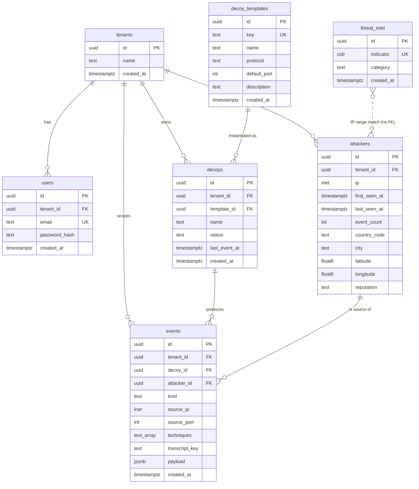

# Chimera — Phase 1 Database Schema Specification

**Status: FROZEN — the M1 source of truth.** Implementation (Drizzle schema, migrations, seed) must conform to this document. Any deviation requires updating this spec first.

## Frozen decisions (approved)

- **Drop ASN** from Phase 1 (`geoip-lite` cannot supply it, and adding a GeoLite ASN DB reintroduces the MaxMind step the project avoids).
- **No PostgreSQL partitioning** in Phase 1 (single `events` table + `created_at` index; partitioning is a Phase 3 concern).
- **Keep tenant support** — multi-tenant-correct from day one to avoid retrofit migration debt.
- **Six core tables** (`tenants`, `users`, `decoy_templates`, `decoys`, `attackers`, `events`) **plus optional `threat_intel`** exactly as designed.
- **`text` + Zod validation** instead of PostgreSQL `enum` types (avoids `ALTER TYPE` churn).
- **Event `payload` stays `jsonb`.**
- **No additional tables or columns** beyond what this specification requires.

## Scope

- Designed only for Phase 1 / Rungs 1–3 (Hackathon Winner). No startup/enterprise features.
- Native types used where they prevent later reparsing: `uuid`, `inet`/`cidr`, `timestamptz`, `jsonb`.
- Status/kind/category/etc. are `text`, validated by the shared Zod contract (optionally a `CHECK`).

---

## Table 1 — `tenants`

**Purpose:** the top-level ownership boundary. Every decoy/event/attacker/user hangs off a tenant so the schema is multi-tenant-correct from day one. Retrofitting a `NOT NULL tenant_id` onto populated tables later is textbook migration debt.

| Column       | Type          | Null | Default              | Why it exists / feature / postpone?    |
| ------------ | ------------- | ---- | -------------------- | -------------------------------------- |
| `id`         | `uuid`        | NO   | `gen_random_uuid()`  | PK; FK target for everything.          |
| `name`       | `text`        | NO   | —                    | Human label for the workspace.         |
| `created_at` | `timestamptz` | NO   | `now()`              | Ordering/audit.                        |

- **PK:** `id` · **FKs:** none · **Indexes:** PK only.
- **Relationships:** 1 → N `users`, `decoys`, `attackers`, `events`.
- **First used:** M1.

---

## Table 2 — `users`

**Purpose:** authentication (register/login → JWT); the gate to the dashboard.

| Column          | Type          | Null | Default             | Why it exists / feature / postpone?                                  |
| --------------- | ------------- | ---- | ------------------- | -------------------------------------------------------------------- |
| `id`            | `uuid`        | NO   | `gen_random_uuid()` | PK.                                                                   |
| `tenant_id`     | `uuid`        | NO   | —                   | Ownership/scoping (M1). Required now to avoid retrofit debt.         |
| `email`         | `text`        | NO   | —                   | Login identifier (M1). Globally `UNIQUE` for unambiguous login.      |
| `password_hash` | `text`        | NO   | —                   | Argon2 hash (M1). Never plaintext.                                   |
| `created_at`    | `timestamptz` | NO   | `now()`             | Audit/order.                                                         |

- **PK:** `id` · **FK:** `tenant_id → tenants(id)`.
- **Indexes:** `UNIQUE(email)`; index on `tenant_id`.
- **Relationships:** tenant 1 → N users.
- **First used:** M1.
- **NOT added (Phase 2+):** `role`/`is_admin`, `name`, `last_login_at`, `email_verified`, OAuth ids, MFA/TOTP, API keys.

---

## Table 3 — `decoy_templates`

**Purpose:** the catalog of deployable decoy types (SSH honeypot, HTTP admin panel). Drives the template-chooser / deploy modal and makes one-click-deploy data-driven.

| Column         | Type          | Null | Default             | Why it exists / feature / postpone?                     |
| -------------- | ------------- | ---- | ------------------- | ------------------------------------------------------- |
| `id`           | `uuid`        | NO   | `gen_random_uuid()` | PK.                                                     |
| `key`          | `text`        | NO   | —                   | Stable slug (`ssh`,`http`) referenced by code. `UNIQUE`.|
| `name`         | `text`        | NO   | —                   | Display name in the deploy modal (Rung 2/3).           |
| `protocol`     | `text`        | NO   | —                   | Wire family (`ssh`/`http`); sets the node type badge.  |
| `default_port` | `int`         | NO   | —                   | Port the decoy listens on (2222/8080).                 |
| `description`  | `text`        | YES  | `NULL`              | Template-card blurb. Rung 3 polish; droppable.         |
| `created_at`   | `timestamptz` | NO   | `now()`             | Order.                                                 |

- **PK:** `id` · **FKs:** none · **Indexes:** `UNIQUE(key)`.
- **Relationships:** template 1 → N `decoys`.
- **First used:** seeded M1 ("seed one decoy_template"); consumed in UI M6.
- **NOT added:** config-schema JSON, versioning, icon/asset refs, per-template resource specs.

---

## Table 4 — `decoys`

**Purpose:** a provisioned decoy instance — the nodes on the live map; the object of provision/list/destroy and the one-click-deploy demo.

| Column          | Type          | Null | Default             | Why it exists / feature / postpone?                                              |
| --------------- | ------------- | ---- | ------------------- | -------------------------------------------------------------------------------- |
| `id`            | `uuid`        | NO   | `gen_random_uuid()` | PK; referenced by every event.                                                   |
| `tenant_id`     | `uuid`        | NO   | —                   | Scoping (M1).                                                                     |
| `template_id`   | `uuid`        | NO   | —                   | Which type it is; protocol/port/badge derived via join (no denormalization).     |
| `name`          | `text`        | NO   | —                   | Node label on the map. M1/M4.                                                     |
| `status`        | `text`        | NO   | `'active'`          | Node state: `active`\|`destroyed` (+ optional `provisioning` for Rung 3). M1/M4/M6.|
| `last_event_at` | `timestamptz` | YES  | `NULL`              | Live-map recency/red-flash + sorting without per-node `MAX()`. Denormalized. M4. |
| `created_at`    | `timestamptz` | NO   | `now()`             | Deploy time; shown in the decoys list.                                           |

- **PK:** `id` · **FKs:** `tenant_id → tenants(id)`, `template_id → decoy_templates(id)`.
- **Indexes:** PK; `index(tenant_id)`; `index(template_id)`. (`index(status)` optional.)
- **Relationships:** tenant 1 → N; template 1 → N; decoy 1 → N `events`.
- **First used:** M1 (list/seed), M4 (map + `last_event_at`), M6 (deploy/destroy).
- **Intentionally NOT stored:** public host/port (Zerops config), region, image ref, autoscale params, lat/lon.

---

## Table 5 — `attackers`

**Purpose:** the per-source-IP aggregate — the map pin and the "unique/most-active attacker" KPIs; the home for geo + reputation enrichment computed once per IP.

| Column           | Type               | Null | Default             | Why it exists / feature / postpone?                                  |
| ---------------- | ------------------ | ---- | ------------------- | -------------------------------------------------------------------- |
| `id`             | `uuid`             | NO   | `gen_random_uuid()` | PK.                                                                   |
| `tenant_id`      | `uuid`             | NO   | —                   | Same IP across tenants = two rows; keeps isolation correct.          |
| `ip`             | `inet`             | NO   | —                   | Source IP (native `inet`). Map pin + dedup key.                      |
| `first_seen_at`  | `timestamptz`      | NO   | `now()`             | Row-creation marker (no separate `created_at`).                      |
| `last_seen_at`   | `timestamptz`      | NO   | `now()`             | Recency + sorting; updated each event. M4.                           |
| `event_count`    | `int`              | NO   | `0`                 | "Unique/most active" KPI without `COUNT(*)` per IP. M4.              |
| `country_code`   | `text`             | YES  | `NULL`              | ISO-2 from geoip-lite; map pin + facet. M5.                          |
| `city`           | `text`             | YES  | `NULL`              | Drawer display. M5.                                                  |
| `latitude`       | `double precision` | YES  | `NULL`              | Map pin. M5.                                                         |
| `longitude`      | `double precision` | YES  | `NULL`              | Map pin. M5.                                                         |
| `reputation`     | `text`             | YES  | `NULL`              | Verdict label from `threat_intel` match. Drawer + facet. M5 (R).     |

- **PK:** `id` · **FK:** `tenant_id → tenants(id)`.
- **Indexes:** `UNIQUE(tenant_id, ip)` (upsert-on-ingest); `index(tenant_id, last_seen_at DESC)`. (`index(country_code)` optional facet.)
- **Relationships:** tenant 1 → N; attacker 1 → N `events`.
- **First used:** schema M1, first populated M2 (ip + counts), enriched M5 (geo/reputation).
- **Removed — `asn`:** `geoip-lite` does not ship ASN data; not on the critical demo path. Dropped from Phase 1.
- **NOT added:** PTR/hostname, org name, tags, notes, blocklist flag.

---

## Table 6 — `events`

**Purpose:** the core interaction record — the live feed rows, the map red-flash trigger, and the drawer content. One row per surfaced interaction: an SSH session (command sequence in the transcript blob, not rows) or a single HTTP request.

| Column           | Type          | Null | Default             | Why it exists / feature / postpone?                                                    |
| ---------------- | ------------- | ---- | ------------------- | -------------------------------------------------------------------------------------- |
| `id`             | `uuid`        | NO   | `gen_random_uuid()` | PK; equals the wire `eventSchema.id`.                                                   |
| `tenant_id`      | `uuid`        | NO   | —                   | Scopes every feed/KPI/search query.                                                    |
| `decoy_id`       | `uuid`        | NO   | —                   | Which node flashed; per-decoy feed. M2/M4.                                              |
| `attacker_id`    | `uuid`        | NO   | —                   | The source (upsert attacker → insert event). Pin/drilldown. M2.                        |
| `kind`           | `text`        | NO   | —                   | `connection`\|`auth_attempt`\|`command`\|`http_request`\|`disconnect`. Feed label.     |
| `source_ip`      | `inet`        | NO   | —                   | Captured at write time — `events` is the immutable log; avoids join on the feed path.  |
| `source_port`    | `int`         | YES  | `NULL`              | From `eventSchema.sourcePort?`. Raw-event drawer detail.                               |
| `techniques`     | `text[]`      | NO   | `'{}'`              | MITRE technique id(s) from the heuristic mapper = technique badge. M5.                  |
| `transcript_key` | `text`        | YES  | `NULL`              | Object-storage key for the SSH session transcript → xterm replay. M5. Null for HTTP.   |
| `payload`        | `jsonb`       | NO   | `'{}'`              | Kind-specific detail (`{username,password}` / `{command}` / `{method,path,...}`). FTS source. |
| `created_at`     | `timestamptz` | NO   | `now()`             | Server-ingest event time: feed ordering, KPI buckets, future partition key.            |

- **PK:** `id` · **FKs:** `tenant_id → tenants(id)`, `decoy_id → decoys(id)`, `attacker_id → attackers(id)`.
- **Indexes:**
  - `index(tenant_id, created_at DESC)` — the feed (primary hot path). M4.
  - `index(decoy_id, created_at DESC)` — per-decoy history / map node. M4.
  - `index(attacker_id)` — attacker drilldown. M5.
  - **FTS (M6):** a generated `tsvector` column over `payload` text + `techniques` + `source_ip::text`, with a **GIN** index — powers Intel Explorer search. Part of the frozen design so it is not a later migration.
- **Relationships:** tenant/decoy/attacker each 1 → N events.
- **First used:** M2 (spine) → M3 (real data) → M4 (feed/map) → M5 (technique/transcript fill) → M6 (FTS).
- **LLM intent label (Rung 3, optional):** store in `payload.classification` (jsonb), not a dedicated column.
- **NOT added:** `severity`/`confidence`/`false_positive`/`analyst_notes`/`alert_id`; per-keystroke child rows.

---

## Table 7 — `threat_intel` *(Recommended `R` — the one optional table)*

**Purpose:** static, bundled reputation list backing reputation enrichment (and an Intel facet). Global reference data — not tenant-scoped, no FK.

| Column       | Type          | Null | Default             | Why it exists / feature / postpone?                          |
| ------------ | ------------- | ---- | ------------------- | ------------------------------------------------------------ |
| `id`         | `uuid`        | NO   | `gen_random_uuid()` | PK.                                                          |
| `indicator`  | `cidr`        | NO   | —                   | Known-bad IP/range (single IP = `/32`). `UNIQUE`. Matched via `attacker.ip <<= indicator`. |
| `category`   | `text`        | YES  | `NULL`              | `tor`/`scanner`/`botnet`/… — label in drawer + facet.        |
| `created_at` | `timestamptz` | NO   | `now()`             | Order.                                                       |

- **PK:** `id` · **FKs:** none · **Indexes:** `UNIQUE(indicator)`; **GiST** index on `indicator` for containment matching.
- **Relationships:** logical match to `attackers.ip` at enrichment time (no referential FK).
- **First used:** M5 (reputation), optional facet M6.
- **First thing to cut** if time/credits tighten — the core wow does not depend on it.

---

## ER Diagram

## Relationship flow

- `tenants` is the root; `users`, `decoys`, `attackers`, `events` all carry `tenant_id`.
- `decoy_templates` (1) → `decoys` (N): a decoy is an instance of a template.
- `decoys` (1) → `events` (N): a node produces interactions.
- `attackers` (1) → `events` (N): a source IP produces interactions; the aggregate carries geo/reputation.
- `threat_intel` matches `attackers.ip` by CIDR containment at enrichment time (no foreign key).

## Attack lifecycle: User → Decoy → Attack → Event → Enrichment → Dashboard

| Stage          | What happens                                                                                             | Tables / columns touched                                                                                          | Milestone |
| -------------- | ------------------------------------------------------------------------------------------------------- | ---------------------------------------------------------------------------------------------------------------- | --------- |
| **User**       | Register/login (JWT), then deploy a decoy from a template                                                | `users` (auth), `decoy_templates` (chooser), `decoys` (insert, `status='active'`)                                | M1 / M6   |
| **Decoy**      | The provisioned node listens on its public port                                                         | `decoys` row exists                                                                                               | M3/M6     |
| **Attack**     | Attacker connects, tries creds, runs commands                                                           | (in-memory in the decoy)                                                                                          | M3        |
| **Event**      | Decoy → NATS → `api` upserts the attacker, inserts the event, bumps counters, pushes over WS            | `attackers` (upsert `ip`, `last_seen_at`, `event_count++`), `events` (insert), `decoys.last_event_at`            | M2→M4     |
| **Enrichment** | `worker-enrich`: geoip-lite → attacker geo; `threat_intel` match → reputation; heuristic → techniques; transcript → object storage | `attackers.{country_code,city,latitude,longitude,reputation}`, `events.{techniques,transcript_key}` | M5        |
| **Dashboard**  | WS fan-out: node red-flash (`decoy_id` + `last_event_at`), feed (`events`), pin (`attacker.lat/long`), drawer (`payload` + transcript via `transcript_key` + `techniques`), Intel search (FTS/GIN) | reads across all above | M4→M6     |

## Simplifications, cuts, and traps

**Simplifications made:**

1. **No `sessions` table.** A session = one `events` row + the transcript blob in object storage. A first-class sessions table with per-keystroke rows arrives with the Phase 2 replay player.
2. **No partitioning.** Phase 1 = single `events` table + `index(tenant_id, created_at)`; `created_at` is already the right key so a future partition switch is clean.
3. **`text` + Zod/`CHECK`, not Postgres `enum`.**
4. **Justified denormalized counters:** `attackers.event_count`, `decoys.last_event_at`.

**Unnecessary tables:** none beyond flagging `threat_intel` as the single optional (`R`) table and first to cut.

**Migration-debt fields handled now:** `tenant_id` on every owned table; `timestamptz` (not `timestamp`); `inet`/`cidr` (not `text`); `uuid` PKs; `events.created_at` as the canonical time key.

**Tempting fields NOT added:** `attackers.asn`/org/PTR/tags/notes/blocklist; `events.severity`/`confidence`/`false_positive`/`analyst_notes`/`alert_id` and a dedicated LLM `classification` column; `users.role`/MFA/OAuth/api-keys; `tenants.plan`/billing/retention/`settings`; `decoys` host/port/region/image/autoscale; any `audit_log`/`alert_rules`/`integrations`.

## Verdict

This is the smallest schema that still enables a first-place Phase 1 submission: six load-bearing tables plus optional `threat_intel`, covering the entire deploy → attack → flash → intel → isolation demo through Rung 3. Removing any core table or the tenant scoping would break a required demo beat or create mid-hackathon migration debt; adding more would be building for phases not guaranteed to ship.
